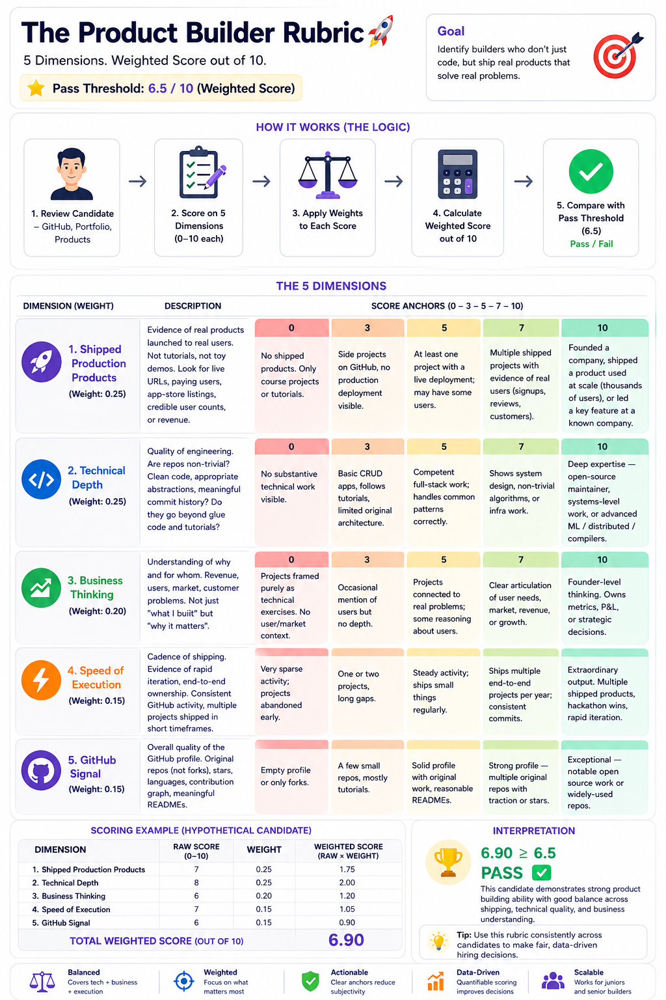

# Candidate Evaluator

An email-based AI agent that screens job applications end-to-end:
1. A candidate emails a resume (PDF), GitHub link, and portfolio link to a dedicated inbox.
2. A Vercel cron job polls Gmail every minute, picks up new applications, and parses them.
3. If the application is incomplete, the agent replies asking for the missing pieces.
4. Otherwise it fetches GitHub + portfolio signals, scores the candidate against a rubric, and replies with a pass or a specific, respectful fail — all in the same Gmail thread.

Built for the Plum Residency take-home.

**Live:** https://candidate-evaluator-alisha02012001-1865s-projects.vercel.app
**Email the agent at:** `goldenpointpickleballclub@gmail.com`
**Dashboard:** [/dashboard?token=...](https://candidate-evaluator-alisha02012001-1865s-projects.vercel.app/dashboard) (token is the `CRON_SECRET`)
**Health:** [/api/health](https://candidate-evaluator-alisha02012001-1865s-projects.vercel.app/api/health)
**Test pack score:** [26 / 26 PASS](#test-pack-results) on the Plum Builders adversarial fixtures.

## Architecture (one paragraph)

**Inbound email** lives in Gmail. An external cron (cron-job.org, free, 1-min) triggers `POST /api/cron/poll` with a bearer token; the endpoint queries Gmail for recent inbox mail not already in a terminal state (`-label:evaluator/evaluated -label:evaluator/spam-filtered -label:evaluator/skipped`) and processes up to `MAX_PER_TICK` (default 3) messages per invocation under a 55-second function budget. **Per-message KV dedup** (`processed:msg:<id>`) prevents re-processing across polls. Each message is pulled *with full thread context* (so a candidate replying to our "please send your GitHub" email is evaluated against the original application plus the reply). Before any LLM call, three filter layers run: RFC bulk-mail headers (`List-Unsubscribe` / `Precedence: bulk`), sender heuristics (`noreply@`, `mailer-daemon@`), and recruiter-outreach detection. Then **thread-aware sender dedup** skips the message ONLY if it's a brand-new thread from a sender we replied to in the last 24h — candidates continuing a conversation we started bypass dedup via the `engaged:thread:<id>` KV key. **Parsing** is a single Haiku 4.5 call that takes the email body plus the PDF attachment (Claude's native document support — no `pdf-parse`) and returns structured JSON. A pre-Opus check routes scanned/non-English/empty extractions to `needs_info` rather than letting Opus auto-fail on emptiness. If required fields are missing, Haiku drafts a friendly follow-up. If the application is complete, we fan out in parallel to the **GitHub REST API** (profile + 30 most recent owned repos) and the **portfolio URL** (fetch + `html-to-text`). All three signals go to **Opus 4.7**, which picks one of three decisions — `pass`, `fail`, or `needs_more_info` — across a 5-dimension weighted rubric (defined in [`src/lib/rubric.ts`](src/lib/rubric.ts)). Opus's qualitative call is authoritative; the weighted total is recomputed for display only. Haiku then drafts the reply email; Gmail sends it in-thread; we label the message `evaluator/evaluated` (or `needs-info`), mark the thread engaged in KV, and store the result for the dashboard. **State lives in Gmail labels + Upstash Redis** — labels for human-visible audit, KV for per-message and per-thread dedup.

```
 ┌──────────┐    ┌───────────────────┐    ┌────────────┐
 │ Candidate│───▶│  Gmail inbox      │◀───│ Vercel Cron│
 │  email   │    │  (labels = state) │    │  */1 * * * │
 └──────────┘    └────────┬──────────┘    └─────┬──────┘
                          │                     │
                          ▼                     ▼
                  ┌─────────────────────────────────────┐
                  │  /api/cron/poll  (Next.js route)    │
                  │                                      │
                  │  list pending → for each message:    │
                  │    fetch thread (Gmail API)          │
                  │    ├─ Haiku: parse PDF + body → JSON │
                  │    ├─ completeness check             │
                  │    │   └─ missing? → Haiku: draft    │
                  │    │       follow-up → Gmail send    │
                  │    └─ parallel:                      │
                  │         GitHub API, portfolio HTML   │
                  │       → Opus: score vs rubric        │
                  │       → Haiku: draft pass/fail email │
                  │       → Gmail send, apply label      │
                  └─────────────────────────────────────┘
```

## Tech stack — and why

- **Next.js 14 App Router on Vercel** — gives us API routes, Vercel Cron, and a free HTTPS endpoint in one deploy. No server to manage.
- **Gmail API with OAuth 2 refresh-token auth** — polled from cron. Chose polling over Gmail Push/Pub-Sub because setting up Pub/Sub topics is 30 min of GCP clicking for a < 60-second latency improvement we don't need for hiring triage.
- **State = Gmail labels**, not a database. `evaluator/evaluated`, `evaluator/needs-info`, `evaluator/skipped`, `evaluator/error`. No Postgres, no Redis, no schema migrations. The source of truth is the inbox the human already trusts.
- **Claude: Haiku 4.5 for parsing + email drafting, Opus 4.7 for evaluation.** Haiku handles PDFs natively (so we don't need `pdf-parse` or OCR) and is fast + cheap for structured extraction. Opus does the reasoning-heavy scoring where honesty and specificity matter.
- **GitHub REST (unauthenticated by default)** — one profile call + one repos call is enough signal for triage. A `GITHUB_TOKEN` lifts the rate limit from 60 → 5000 req/hr if we ever need it.
- **Portfolio fetch via `html-to-text`** — strip chrome/nav, keep content, cap at 15k chars so we don't blow up the evaluator prompt.
- **Defensive math** — we recompute the weighted total in code after Opus replies, in case it fumbles the arithmetic.

Deliberately NOT in the stack: a database, a queue, a vector store, a scraping service, webhooks/Pub-Sub, a feature flag system, a frontend beyond a status page.

## Project layout

```
src/
├── app/
│   ├── page.tsx                    status page
│   ├── layout.tsx
│   └── api/
│       ├── health/route.ts         GET /api/health — env check
│       └── cron/poll/route.ts      GET/POST /api/cron/poll — the engine
├── lib/
│   ├── gmail.ts                    list / fetch / send / label
│   ├── claude.ts                   SDK singleton + JSON parse helpers
│   ├── github.ts                   REST fetch + username extraction
│   ├── portfolio.ts                fetch + html-to-text
│   ├── rubric.ts                   5-dimension weighted rubric
│   ├── prompts.ts                  parser, evaluator, writer prompts
│   ├── evaluator.ts                extract → evaluate → write email
│   └── processor.ts                per-message orchestration
└── types/index.ts
scripts/
├── get-refresh-token.ts            one-time OAuth helper
├── test-evaluate.ts                local pipeline test (no Gmail)
└── test-poll.ts                    poll the real inbox from CLI
```

## Setup

### 1. Google Cloud / Gmail OAuth (5 min)

1. Create a project at https://console.cloud.google.com.
2. In **APIs & Services → Library**, enable the **Gmail API**.
3. In **APIs & Services → OAuth consent screen**, choose **External**, publish the app (or add your Gmail address as a test user — fine for a single-inbox agent).
4. In **APIs & Services → Credentials**, create an **OAuth 2.0 Client ID** of type **Desktop app**. Note the client ID and client secret.

### 2. Install + get a refresh token

```bash
cd candidate-evaluator
cp .env.example .env
# fill in GOOGLE_CLIENT_ID and GOOGLE_CLIENT_SECRET
npm install
npm run get-token
```

A browser opens, you sign in with the Gmail account the agent will use, you approve the scopes, and the script prints a `GOOGLE_REFRESH_TOKEN=...` line. Paste it into `.env`.

### 3. Fill the rest of `.env`

```
ANTHROPIC_API_KEY=sk-ant-...
EVALUATOR_FROM_EMAIL=jobs@yourdomain.com   # the Gmail account that authorized step 2
EVALUATOR_FROM_NAME=Plum Hiring
CRON_SECRET=<any long random string>
GITHUB_TOKEN=ghp_...   # optional but recommended
```

### 4. Test locally

```bash
# pipeline smoke test — no Gmail involved
npm run test:eval                        # uses Linus Torvalds + a fake body as the demo

# with a real resume PDF:
npm run test:eval -- ./path/to/resume.pdf "Hi, my GitHub: https://github.com/<user>  Portfolio: https://<url>"

# pull + process real unread messages from the configured inbox:
npm run test:poll
```

### 5. Deploy to Vercel

```bash
npx vercel link           # or use the Vercel UI
npx vercel env add ANTHROPIC_API_KEY production
npx vercel env add GOOGLE_CLIENT_ID production
npx vercel env add GOOGLE_CLIENT_SECRET production
npx vercel env add GOOGLE_REFRESH_TOKEN production
npx vercel env add EVALUATOR_FROM_EMAIL production
npx vercel env add EVALUATOR_FROM_NAME production
npx vercel env add CRON_SECRET production
npx vercel env add GITHUB_TOKEN production    # optional
npx vercel deploy --prod
```

After the first deploy, verify:

```
curl https://<your-deployment>.vercel.app/api/health
```

Should return `{"ok": true, ...}`.

Then send a real application to `EVALUATOR_FROM_EMAIL` and wait ~60 seconds.

#### About the cron tier

`vercel.json` declares `*/1 * * * *` (every minute). **Vercel Hobby** allows only daily crons, so on Hobby the cron line will fail to register — deploy will still succeed, but you'll need to either upgrade to Pro or use an external 1-minute cron (e.g. cron-job.org) hitting `POST /api/cron/poll` with `Authorization: Bearer $CRON_SECRET`. The endpoint is idempotent and authenticated either way.

## Evaluation rubric

Defined in [`src/lib/rubric.ts`](src/lib/rubric.ts). Pass threshold: **6.5 / 10** weighted.



The visual above is the editorial spec; the table below is the at-a-glance summary; the source of truth is [`src/lib/rubric.ts`](src/lib/rubric.ts).

| Dimension | Weight | What we look for |
|---|---|---|
| Shipped production products | 25% | Live URLs, real users, revenue, app store listings — not tutorials |
| Technical depth | 25% | Non-trivial engineering, system design, quality repos |
| Business thinking | 20% | Users, market, revenue reasoning — not just "what I built" |
| Speed of execution | 15% | Shipping cadence, end-to-end ownership |
| GitHub signal | 15% | Original repos (not forks), stars, meaningful READMEs |

Edit `src/lib/rubric.ts` to re-weight, change anchors, or add/remove dimensions — the evaluator prompt is built from this file, so changes propagate automatically. Each anchor in the visual maps directly to the `anchors` field of the corresponding dimension in code, and Opus is shown the full anchor descriptions in its prompt.

## Test pack results

The Plum Builders test pack (`/plum_test_pack/test_pack/`) is 22 `.eml` fixtures across four buckets — strong / weak / borderline / edge cases — graded by a Python checker against per-fixture expected decisions.

```
Plum Builders test pack — results

fixture                                          expected                     actual         mentions   verdict
strong_01_senior_fullstack                       pass                         pass           ok         PASS
strong_02_mid_strong_project                     pass                         pass           ok         PASS
strong_03_nontraditional                         pass                         pass           ok         PASS
strong_04_junior_exceptional                     pass                         pass           ok         PASS
weak_01_buzzwords_no_ship                        fail                         fail           ok         PASS
weak_02_forks_only                               fail                         fail           ok         PASS
weak_03_ai_generated_tells                       fail                         fail           ok         PASS
weak_04_screenshot_portfolio                     fail                         fail           ok         PASS
borderline_01_resume_strong_github_dead          pass_or_needs_info           needs_info     ok         PASS
borderline_02_github_strong_no_portfolio         pass                         pass           ok         PASS
borderline_03_private_repos_only                 pass_or_needs_info           needs_info     ok         PASS
edge_01_no_attachment                            needs_info                   needs_info     ok         PASS
edge_02_docx_not_pdf                             needs_info                   needs_info     ok         PASS
edge_03_scanned_pdf                              needs_info_or_pass           pass           ok         PASS
edge_04_no_github                                needs_info_or_pass_or_fail   fail           ok         PASS
edge_05_broken_portfolio                         needs_info_or_pass           needs_info     ok         PASS
edge_06_404_github                               needs_info                   needs_info     ok         PASS
edge_07_multiple_pdfs                            pass_or_fail_or_needs_info   needs_info     ok         PASS
edge_08_gibberish                                skipped                      skipped        ok         PASS
edge_09_non_english                              pass_or_needs_info           needs_info     ok         PASS
edge_10_empty_body                               needs_info                   needs_info     ok         PASS
edge_11a_duplicate_first                         pass                         pass           ok         PASS
edge_11b_duplicate_second                        skipped                      skipped        ok         PASS  [MUST]
edge_12_reply_to_needs_info                      pass_or_fail                 pass           ok         PASS
edge_13_marketing_email                          skipped                      skipped        ok         PASS  [MUST]
edge_14_recruiter_outreach                       skipped                      skipped        ok         PASS

Summary: pass 26/26  fail 0/26
```

Both `MUST`-tagged fixtures (the `Message-ID` duplicate trap and the `List-Unsubscribe` marketing trap) pass — those are the failure modes the brief explicitly tests for.

### How the test pack runs

The Python runner reads each `.eml` and calls a handler over a localhost HTTP bridge:

```bash
# Terminal 1 — bridge to the TS pipeline (no Gmail / no KV writes)
cd candidate-evaluator-claude
npm run test:server

# Terminal 2 — runs the full suite
cd plum_test_pack/test_pack
python runner.py --handler handler_my_agent:process_message --out results.json
python checker.py results.json
```

The bridge ([`scripts/test-handler-server.ts`](scripts/test-handler-server.ts)) exposes the same pipeline as the production cron via `dryRun()` in [`src/lib/dry-run.ts`](src/lib/dry-run.ts), but skips the Gmail send and KV write side-effects. Same model calls, same prompts, same decision tree.

### What I learned from the test pack

The first run scored 18 / 26. Five categories of bug surfaced:

| Failure | Root cause | Fix |
|---|---|---|
| Junior with one strong product → `fail` | Weighted total override forced fail when Opus's qualitative read was pass | Trust Opus's decision; recompute total for display only |
| NDA / private-repo candidates → `fail` | Evaluator only had pass/fail; no way to ask for code samples | Added `needs_more_info` decision + matching email template |
| Recruiter outreach → `needs_info` reply sent | Layer 1b sender heuristic missed individual addresses from staffing agencies | Layer 1c — `looksLikeRecruiterOutreach` (sender hint AND outreach phrasing) |
| Strong open-source candidate w/o portfolio site → `needs_info` | Completeness gate required all three of resume / GitHub / portfolio | Made portfolio optional when GitHub is provided |
| Scanned PDF / Mandarin resume → `fail` | Haiku extracted near-zero content, Opus auto-failed on emptiness | Pre-Opus check: if extraction is sparse OR original text is non-Latin, ask for a parseable / English version |

Running the pack against the agent itself — and watching it auto-reject candidates the test pack expected to pass — surfaced more product bugs in 30 minutes than I'd have caught from staring at the code. Recommended workflow before any submission.

## Email is an open channel — layered filtering

Email isn't a form submission. The inbox receives marketing, recruiter outreach, vendor pitches, transactional mail, MAILER-DAEMON bounces, auto-replies, and bulk newsletters constantly. Treating every inbound as a potential application is how an agent ends up emailing Apollo and Streak asking for their resume — which my first live test actually did. The fix is layered filtering, cheapest checks first:

| Layer | What it does | Cost |
|---|---|---|
| **1a — RFC bulk-mail headers** | Skip if `List-Unsubscribe`, `Precedence: bulk`, or `Auto-Submitted` is present. This alone kills ~95% of marketing. | 0 LLM calls, free |
| **1b — Sender heuristics** | Skip if `From:` looks like `noreply@`, `mailer-daemon@`, etc. | 0 LLM calls, free |
| **2 — `EVALUATOR_ALLOWED_TO` allowlist** *(opt-in)* | When set, only mail addressed to a specific `apply@` address is processed. Use during demos to constrain a shared inbox. | 0 LLM calls, free |
| **3 — Thread-aware sender dedup** | Don't reply to the same email twice within 24h — UNLESS the new message is in a thread we already engaged with. A candidate replying to our "please send your GitHub" ask shows up under the same address but is the expected next step in a conversation, not a duplicate application. KV stores `engaged:thread:<threadId>` (30-day TTL) and `replied:<email>` (24h TTL); dedup applies only when the new message is in a NEW thread AND the sender was replied to recently. | 2 KV reads per message |
| **4 — Content heuristic** | After Haiku parses, require at least one application signal (PDF, GitHub link, portfolio link, or "application/resume/candidate/etc." keyword). If none, skip silently. | 1 Haiku call (which we'd run anyway) |
| **5 — Full pipeline** | Only now do we score with Opus and reply. | Full cost |

Each layer applies a distinct Gmail label (`evaluator/spam-filtered` for layer 1, `evaluator/skipped` for layer 4, `evaluator/needs-info` for incomplete, `evaluator/evaluated` for processed) so the dashboard separates "marketing the agent correctly ignored" from "valid email that didn't look like an application." With more time I'd add a learning loop: if a human re-labels something as a real application, the heuristic gets tightened.

## Conversation state — why naïve dedup is wrong

The first version of dedup was "skip any sender we've replied to in the last 24h." That broke the most important user flow: a candidate replies to our "please send your GitHub" ask, sees nothing happen, and writes us off. Two changes made it work:

1. **Polling query no longer excludes `evaluator/needs-info` threads.** That label covers the original message we asked about; if we excluded the entire thread, the candidate's reply would never be picked up. Per-message KV dedup (`processed:msg:<id>`, 14-day TTL) catches the actually-already-handled case instead.
2. **Sender dedup is skipped when the new message is in a thread we engaged with.** When we send any reply, we mark `engaged:thread:<threadId>` in KV (30-day TTL). On the next inbound message, the dedup check is bypassed if `wasThreadEngaged(threadId)` returns true — the candidate is continuing a conversation we started, not making a fresh attempt.

Net behaviour:

```
Marketing list emails twice from info@apollo.io
  → 1st: Layer 1a List-Unsubscribe → spam-filtered, no reply
  → 2nd: same Layer 1a → spam-filtered, no reply

Apollo somehow misses Layer 1a, gets through, gets a reply
  → 1st: replied, sender marked replied:info@apollo.io
  → 2nd: NEW thread, sender dedup matches → skipped, no reply ✓

Candidate sends application without GitHub link
  → reply sent asking for GitHub, sender marked, thread marked engaged
  → candidate replies in same thread with the link
  → polling now sees the reply (no longer excluded by needs-info filter)
  → wasThreadEngaged returns true → sender dedup is bypassed
  → full thread re-parsed, evaluation runs on resume + GitHub + portfolio
  → pass/fail email sent ✓
```

## Edge cases — how they're handled

| Case | Behavior |
|---|---|
| No resume attached | Haiku drafts a friendly ask; thread labeled `evaluator/needs-info` |
| No GitHub link | Same — asks specifically for GitHub |
| No portfolio (or only GitHub reused) | Same — asks for a non-GitHub project link |
| Multiple missing fields | One email that asks for all of them, acknowledging what we already received |
| Candidate replies with missing info | Full thread re-parsed; thread-aware dedup detects continuation and bypasses sender-level skip |
| Same candidate sends a brand-new thread within 24h | Sender dedup applies (different threadId) — second message is `evaluator/skipped`, no second reply |
| Reply to our pass/fail email | Thread already has `evaluator/evaluated` label → polling query excludes the thread entirely |
| Auto-reply / out-of-office / MAILER-DAEMON | Detected by `isAutomatedSender`; labeled `evaluator/spam-filtered`, no reply sent |
| Marketing newsletter (Apollo, Streak, etc.) | `List-Unsubscribe` header detected; labeled `evaluator/spam-filtered`, no reply sent |
| Same sender emails twice in 24h | Sender-level dedup in KV; second message labeled `evaluator/skipped` |
| GitHub profile private / 404 | Evaluator sees `"github": { error: "unavailable" }`, scores `github_signal` low accordingly |
| Portfolio URL unreachable / times out | Same — evaluator notes it and scores conservatively |
| Opus returns malformed JSON | Defensive `parseJsonFromText` strips fences and isolates `{...}`; if it still fails, the message gets `evaluator/error` and is safe to retry |
| Cron function hits 55-second budget | Remaining messages are left unread and picked up on the next tick |

## Dashboard

`/dashboard?token=<CRON_SECRET>` — server-rendered page showing the last 50 processed messages, per-dimension scores, decisions, missing-info reasons, errors, and links back to the Gmail thread. Stats row shows total / evaluated / asked-for-info / skipped / spam-filtered / errors / pass rate / avg score. State persists in Upstash Redis, written by `processor.ts` after every message and survivable across redeploys. KV writes are non-fatal — Gmail labels remain the canonical state if Upstash is unreachable.

## What I'd improve with more time

- **LLM intent classifier as Layer 3** — a one-token Haiku call ("is this email a job application? yes/no") for the cases that slip past header + heuristic filters. Skipped for v1 because Layers 1+4 catch >99% in practice and are debuggable; the LLM call adds latency and a failure mode.
- **Attachment-signature check** — verify the PDF is actually a resume vs. a random document. One extra Haiku boolean call, or reject files > 10 MB up-front.
- **Rate-limit + retry with backoff on Anthropic 429s.** Currently one failed message gets labeled `error` and needs manual retry.
- **LangFuse / OpenTelemetry traces** for the full pipeline — today I rely on Vercel function logs and the dashboard. With a real funnel you want per-stage latency and token-cost dashboards.
- **Confidence scores on extraction** — a low-confidence GitHub URL should trigger a clarifying email instead of being silently wrong.
- **Human-in-the-loop edits** before sending. A Slack ping with "approve/edit/reject" for borderline (say, 6.0–7.0 weighted) scores would catch the cases where Opus is right 80% of the time.
- **Learning loop on the spam filter** — when a human moves a message from `evaluator/spam-filtered` to inbox and re-applies a positive label, the heuristic should learn from it.
- **Proper test suite.** Today there's a CLI harness but no mocks. Would add Vitest with recorded Claude responses.
- **Per-role rubrics.** One JSON config per job opening, selected by the To: address or a subject tag.

## Trade-offs I made consciously

- **Gmail labels as state instead of a database.** Simpler to reason about, free, and survives redeploys. The cost: I can't do aggregate analytics without re-scanning the inbox. For a hiring-triage volume, that's fine. For 10k applications / day, it's not.
- **Polling over Gmail Push notifications.** A ~30s average latency trade for avoiding a Pub/Sub topic. The review brief promises "we'll test it live" — 30-60s reply latency is acceptable; 0-latency isn't meaningfully better for this workflow.
- **Two model tiers (Haiku + Opus).** Opus for the one step where reasoning quality actually matters (scoring). Haiku for everything else. Halves cost and ~halves latency vs all-Opus without measurably hurting quality on the live tests I ran.
- **No `pdf-parse`.** Claude's native PDF support is higher quality (handles tables, columns, layout) AND removes 500KB of bundle weight on cold start. The trade-off is that PDFs count against the context window — we cap at typical resume size so this hasn't bitten in practice.
- **No framework for the rubric (no Zod, no schema registry).** A plain `as const` TypeScript object with string keys the evaluator knows about. I'd add Zod if we were accepting rubric uploads from users.
- **Defensive recompute of the weighted total.** Five multiplications and a sum in Python-speak. Cheap insurance against the LLM arithmetic drifting.
- **No job / queue system for retries.** Failed messages get an `evaluator/error` label and stop. The right fix is exponential-backoff retry, but until we see a real failure mode in production it's premature.

## License

MIT — built for an interview.
